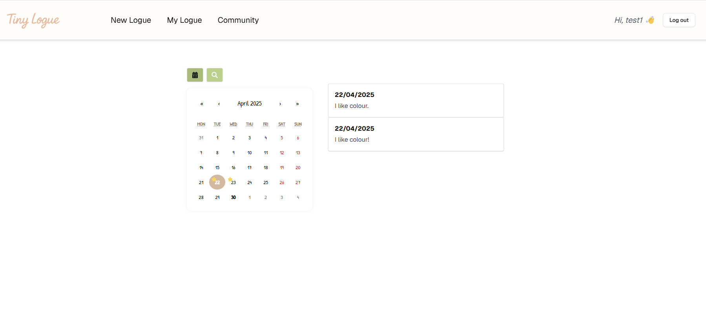

# Tiny Logue ✏️

Welcome to Tiny Logue, an AI-assisted English learning platform designed for building daily writing habits.
This service helps users practise English naturally by writing short logues every day and receiving gentle AI feedback.

  

## 🚀 Features

- **Daily Writing Habit**: Encourages users to write a short English logue every day.
- **AI Feedback**: Instantly receive natural corrections and suggestions based on your intended meaning.
- **Responsive Design**: Optimised for mobile, tablet, and desktop experiences.
- **Simple and Calm UI**: Designed for focused and distraction-free writing.

## ⚙️ Technologies

- **Next.js**
- **React**
- **Tailwind CSS**
- **TypeScript**
- **Firebase (Authentication & Firestore)**
- **OpenAI API (AI feedback)**

## 📬 Contact

- **Email**: miyeon5230@gmail.com
- **GitHub**: [github.com/valencia0523](https://github.com/valencia0523)
- **LinkedIn**: [linkedin.com/in/valencia0523](https://www.linkedin.com/in/valencia0523)
